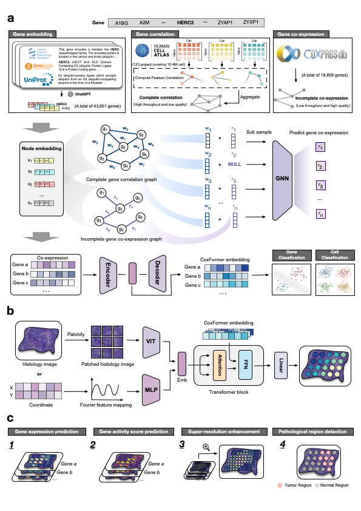

# CoxFormer  
**CoxFormer enables spatial omics inference with multimodal generative modeling**

---

## Overview

CoxFormer is a universal gene embedding and multimodal spatial inference framework designed to model transcriptome-wide gene–gene relationships and enable generative prediction across spatial omics contexts.

The framework consists of two core components:

1. **Gene embedding module (`embedding/`)** – learns transcriptome-wide gene representations (CoxFormer gene embeddings).
2. **Spatial generative module (`spatial/`)** – a Transformer-based multimodal generative model built upon CoxFormer gene embeddings.

By integrating biologically informed gene embeddings with a flexible generative architecture, CoxFormer supports transcriptome-wide inference, region detection, and spatial super-resolution without relying on external single-cell references.

---

## Framework

  

**Overview of the CoxFormer framework.**  
CoxFormer first learns transcriptome-wide gene embeddings from co-expression signals. These embeddings are then integrated into a multimodal Transformer-based generative framework for spatial inference, enabling gene- cell- and tissue-level downstream tasks.

---

## Core Package

### 1. `embedding/`

Implements the training pipeline for CoxFormer gene embeddings.

This module provides:

- Construction of gene–gene relationships  
- Representation learning for transcriptome-wide embeddings  
- Export of pretrained CoxFormer gene embeddings  

The resulting embeddings serve as universal priors for downstream tasks.

---

### 2. `spatial/`

Implements a multimodal generative spatial inference model based on CoxFormer embeddings.

This module supports:

- Spatial gene expression prediction  
- Gene activity score prediction  
- Pathological region detection  
- Super-resolution enhancement  

---

## Tutorials

Comprehensive tutorials demonstrate how to use CoxFormer for gene-level, cell-level, and tissue-level applications:

- `Celltype_annotation_tutorial.ipynb`
- `Co-expression_completion_tutorial.ipynb`
- `Gene_activity_score_prediction_tutorial.ipynb`
- `Gene_expression_prediction_tutorial.ipynb`
- `Pathological_region_detection_tutorial.ipynb`
- `Super_resolution_enhancement_tutorial.ipynb`

Each tutorial provides end-to-end examples from preprocessing to visualization.

---

## Benchmarks

CoxFormer is systematically evaluated through comparative benchmarking at gene, cell, and tissue levels.

### Gene-level benchmarks 

- Bivalent gene classification benchmark  
- Dosage sensitivity classification benchmark  
- Methylation classification benchmark  
- Transcription factor range benchmark  

### Cell-level benchmark 

- Diffuse Large B-cell Lymphoma FFPE (DLBL) cell type annotation
- Lung Cancer FFPE (LC) cell type annotation
- Breast Cancer FFPE (BC) cell type annotation
- Human CD34$^{+}$ Bone Marrow (BM) cell type annotation

### Tissue-level benchmarks 

- Gene expression prediction benchmark  
- Pathological region detection benchmark  
- Super-resolution enhancement benchmark  

Each benchmark reproduces quantitative evaluations and visualization outputs.

---

## Datasets and Baseline

- \- `Dataset/` – processed datasets used for gene-level, cell-level, and spatial-level benchmarks. Original data sources include:

  \- **Gene classification datasets** are available at: 
  https://huggingface.co/datasets/ctheodoris/Genecorpus-30M/tree/main/example_input_files/gene_classification

  \- **Cell-level scRNA-seq datasets**: 
  Diffuse Large B-cell Lymphoma FFPE (DLBL), Breast Cancer FFPE (BC), and Lung Cancer FFPE (LC) are accessed from the CZ CELLxGENE collection: 
  https://cellxgene.cziscience.com/collections/bd552f76-1f1b-43a3-b9ee-0aace57e90d6 
  Human CD34⁺ Bone Marrow (BM) is downloaded via `scvelo.datasets.bonemarrow()`.

  \- **10x Visium human breast cancer spatial transcriptomics (HBC1–6)** are available from Zenodo: 
  https://zenodo.org/record/4739739 
  Corresponding samples: `CID4535` (HBC1), `CID44971` (HBC2), `CID4465` (HBC3), `CID4290` (HBC4), `1160920F` (HBC5), `CID3586` (HBC6).

  \- **10x Chromium human breast cancer scRNA-seq** data are available from GEO under accession: 
  GSE176078 
  https://www.ncbi.nlm.nih.gov/geo/query/acc.cgi?acc=GSE176078

  \- **Spatial ATAC–RNA-seq human brain hippocampal spatial transcriptomics and epigenomics** data are available at: 
  https://cells.ucsc.edu/?ds=brain-spatial-omics

  \- **10x Xenium human skin melanoma datasets**: 
  Section A: 
  https://www.10xgenomics.com/datasets/human-skin-preview-data-xenium-human-skin-gene-expression-panel-add-on-1-standard 
  Section B: 
  https://www.10xgenomics.com/datasets/human-skin-preview-data-xenium-human-skin-gene-expression-panel-1-standard

  \- **10x Visium human colorectal cancer liver metastasis spatial transcriptomics (CRC1–2, LM1–2)** are available from scCRLM: 
  http://www.cancerdiversity.asia/scCRLM 
  Corresponding samples: `ST-P1,colon` (CRC1), `ST-P4,colon` (CRC2), `ST-P2,liver` (LM1), `ST-P4,liver` (LM2).

  \- **Illumina NextSeq 500 scRNA-seq (normal human colon)**: 
  GEO accession GSM7290762 
  https://www.ncbi.nlm.nih.gov/geo/query/acc.cgi?acc=GSM7290762

  \- **Illumina NextSeq 500 scRNA-seq (normal human liver)**: 
  GEO accession GSM7290760 
  https://www.ncbi.nlm.nih.gov/geo/query/acc.cgi?acc=GSM7290760

---

## Key Features

- Transcriptome-wide gene embedding learning  
- Multimodal Transformer-based generative inference  
- Zero-shot inference for unassayed genes  
- Region-aware pathological detection  
- Spatial super-resolution enhancement  
- Unified framework across gene, cell, and tissue tasks  
